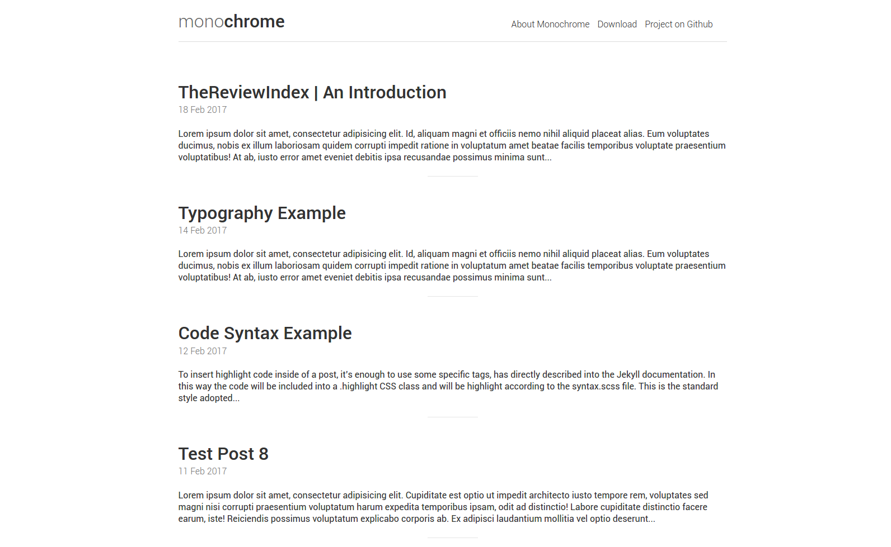

## About
Monochrome is a minimal, responsive theme created for Jekyll. The goal of Monochrome is to provide a ready to use, plug and play theme for those who want to set up a blog, and focus solely on the content.

